## 👋 Hi, I’m **Ahortu Derrick**

🚀 Software Developer | Python • JavaScript • Systems & Automation  
I enjoy building practical solutions, learning new technologies, and working on data + automation projects.

---

### 📫 Connect with me
- 💬 WhatsApp: [https://wa.me/+447402916855]  
- 📧 Email: ahortuderrick0@gmail.com  

---
## 💻 Languages

  
  
  
  
  
  
  
  
  
  
  
  
  

### Topics
- config
- github-config

---

## 📈 GitHub Stats

  

  
  

  
  

---

## 🏆 Achievements

  

---

### ✍️ Random Dev Quote

  

  

  

